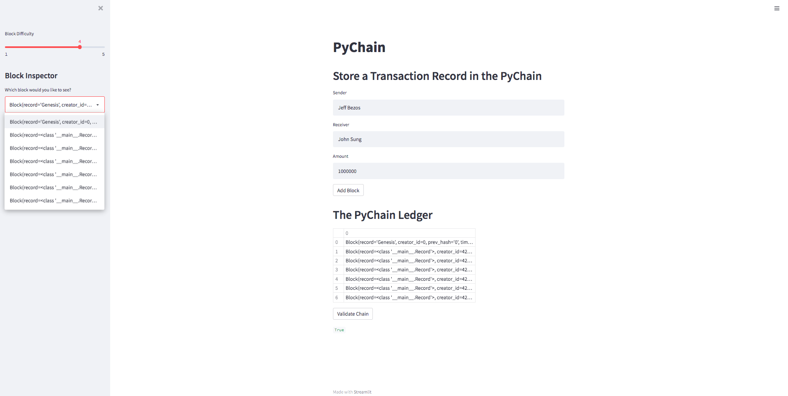

<!-- header is made with: https://github.com/kyechan99/capsule-render -->

[John Sung](https://linkedin.com/in/john-sung-3675569) 
                                 

---

### Table of Contents

* [Overview](#overview)
* [Requirements](#requirements)
* [Data](#data)
* [Visualization](#visualization)
* [User Experience](#user-experience)
* [License](#license)  

---

## Overview

Blockchain is an online application that allows our users to build a blockchain ledger system. Python was the back-end code as Streamlit was used in the front-end. This ledger allows the user to conduct financial transactions and verify its accuracy. Lastly PyChain ledger

---

## Requirements

This project leverages python 3.7 and Streamlit.

A [conda](https://docs.conda.io/en/latest/) environment with liabraries listed below and [Jupyter Notebook/Lab](https://jupyter.org/) are required to run the code.

The following library was used:

2. [Streamlit](https://streamlit.io/) - Streamlit turns data scripts into shareable web apps in minutes.

Install the following librarie(s) in your terminal...

    pip install streamlit
 
---

## Visualization

## PyChain Ledger Demo:

## Screenshot of block contents and hashes in the Streamlit drop-down menu detailing a blockchain that consists of multiple blocks:

## Streamlit application page, indicating the validity of the blockchain:

---

## User Experience

Go to the Anaconda Prompt to launch JupyterLab by typing Jupyter Lab. To use this application simply clone the repository and run the pychain.py in your Jupyter Lab. Open a terminal and input streamlit run pychain.py or simply choose from the two options below.

Please experience Blockchain for yourself. Choose between the following... 

1) CLICK https://share.streamlit.io/jcsung-star/blockchain_ledger/main/pychain.py

2) SCAN the QR Reader using the camera from your phone. 

---

## License

MIT License

Copyright (c) 2022 John Sung

Permission is hereby granted, free of charge, to any person obtaining a copy
of this software and associated documentation files (the "Software"), to deal
in the Software without restriction, including without limitation the rights
to use, copy, modify, merge, publish, distribute, sublicense, and/or sell
copies of the Software, and to permit persons to whom the Software is
furnished to do so, subject to the following conditions:

The above copyright notice and this permission notice shall be included in all
copies or substantial portions of the Software.

THE SOFTWARE IS PROVIDED "AS IS", WITHOUT WARRANTY OF ANY KIND, EXPRESS OR
IMPLIED, INCLUDING BUT NOT LIMITED TO THE WARRANTIES OF MERCHANTABILITY,
FITNESS FOR A PARTICULAR PURPOSE AND NONINFRINGEMENT. IN NO EVENT SHALL THE
AUTHORS OR COPYRIGHT HOLDERS BE LIABLE FOR ANY CLAIM, DAMAGES OR OTHER
LIABILITY, WHETHER IN AN ACTION OF CONTRACT, TORT OR OTHERWISE, ARISING FROM,
OUT OF OR IN CONNECTION WITH THE SOFTWARE OR THE USE OR OTHER DEALINGS IN THE
SOFTWARE.

---

